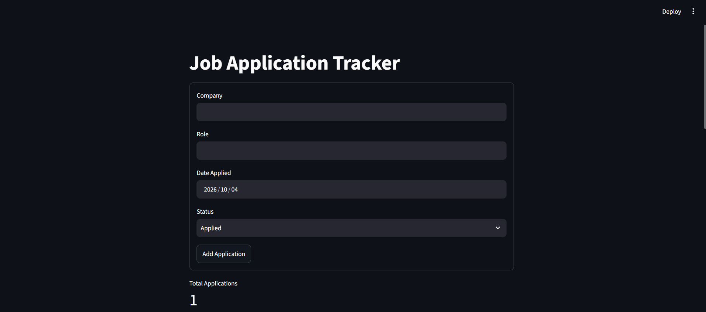

# Job Application Tracker

A simple, beginner-friendly job application tracker built with **Python**, **Streamlit**, **SQLite** and **pandas**.



## Features

- Add an application: company, role, date applied and status (Applied, Interview, Offer, Rejected)
- Dashboard with key stats: total applications, interviews, offers and conversion rate
- Table of all applications
- Bar chart of applications by status
- Data stored locally in a SQLite database (`applications.db`, created on first run)

## Tech stack

- [Streamlit](https://streamlit.io/) for the UI
- [pandas](https://pandas.pydata.org/) for data handling and stats
- [SQLite](https://www.sqlite.org/) for local storage

## Project structure

```
job_tracker/
├─ app.py            # Streamlit app
├─ requirements.txt  # Dependencies
├─ .gitignore
└─ applications.db   # Created on first run (not committed)
```

## Run it locally

```bash
git clone https://github.com/<your-username>/job-tracker.git
cd job-tracker
python -m pip install -r requirements.txt
streamlit run app.py
```

The app opens at http://localhost:8501.

## Note on deployment

SQLite stores data in a local file. On hosts with an ephemeral filesystem (such as Streamlit Community Cloud), the data resets when the app restarts, and all visitors share the same database. For a persistent hosted version, switch to a hosted database.

## License

MIT (add a LICENSE file if you want to publish under this license).
